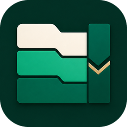
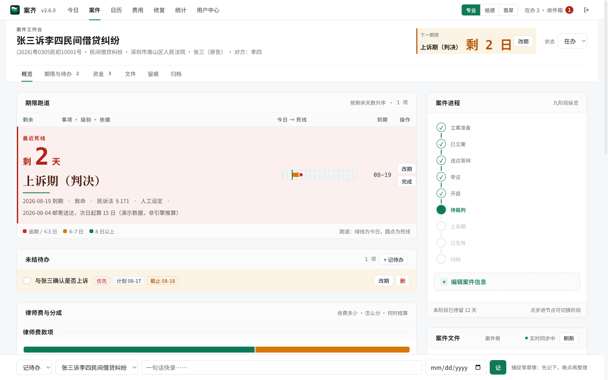
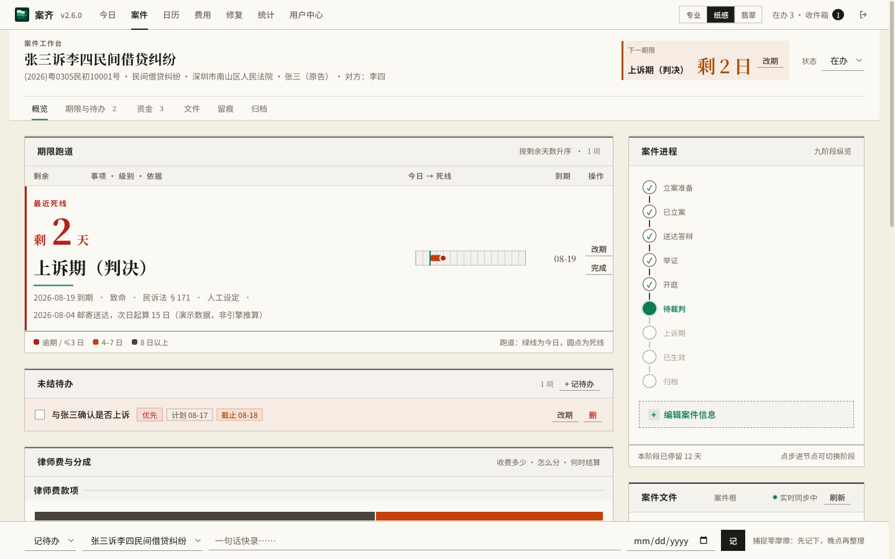
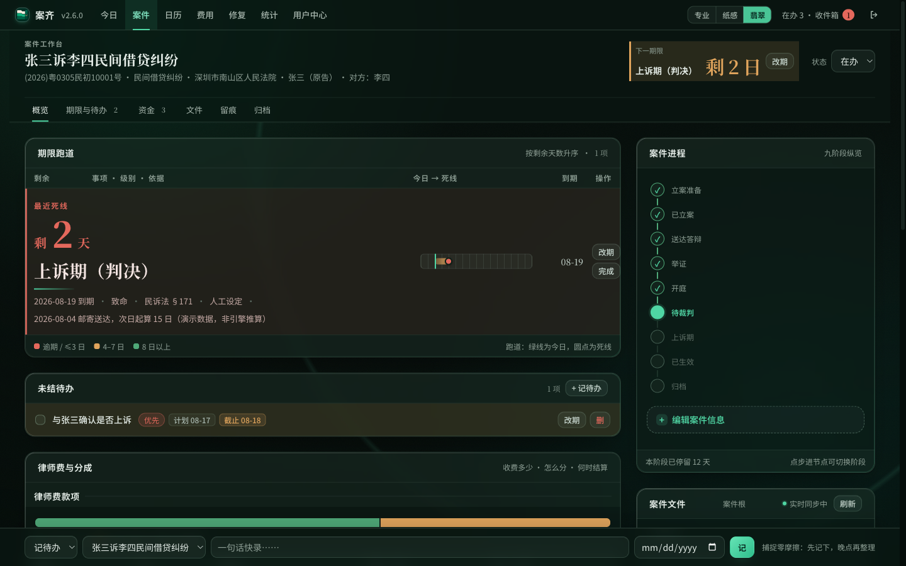
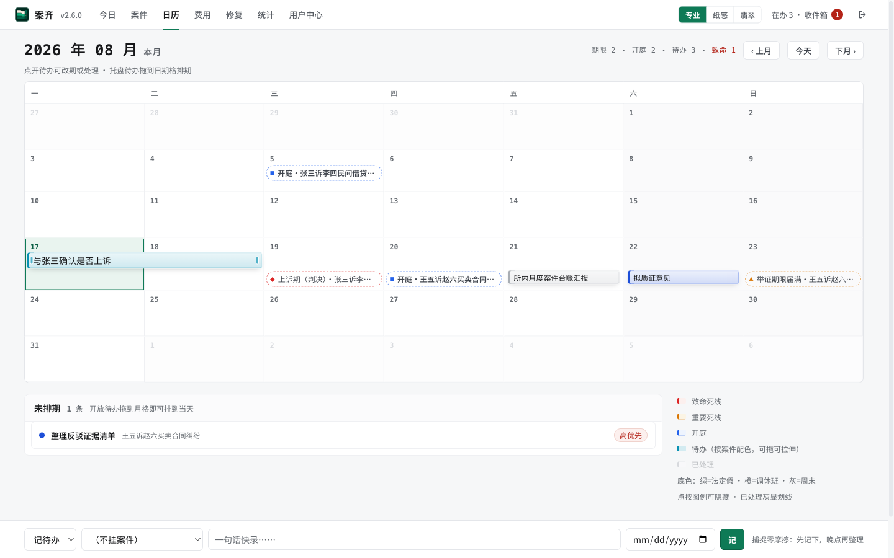
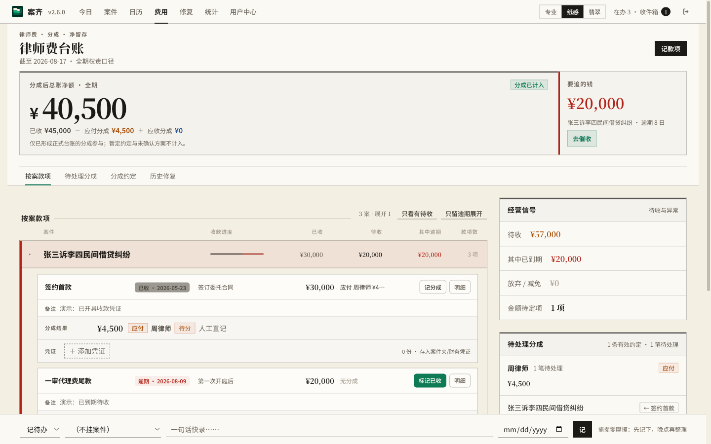
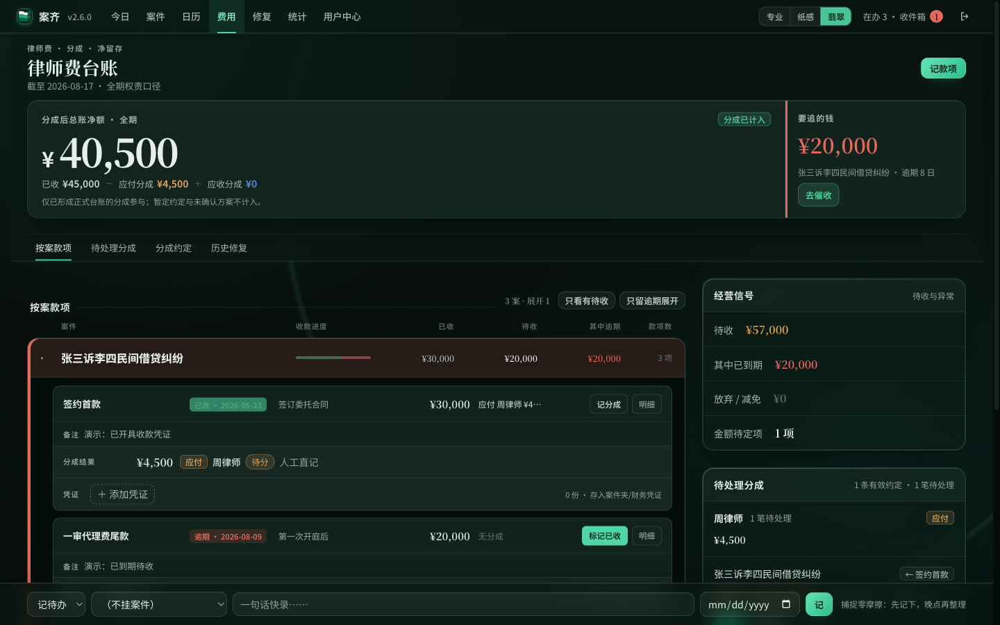
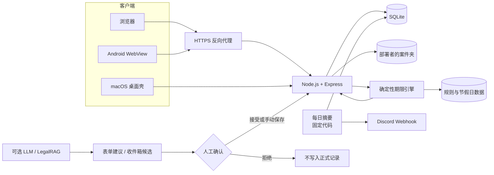

<p align="center">
  
</p>

<h1 align="center">案齐 ANQI</h1>

<p align="center">为独立执业律师设计的自托管案件工作台</p>

<p align="center">
  <a href="https://github.com/zj-ai-lab/anqi/releases/latest"></a>
  <a href="LICENSE"></a>
  
  
  
</p>

<p align="center">
  
</p>

> [!WARNING]
> 案齐是案件管理工具，不是法律意见、法律检索服务或执业替代品。内置期限规则不保证完整、持续有效或适用于具体案件；启用规则前，必须由具备相应资格的人结合现行法、司法解释、法院通知和个案情况独立核验。任何期限、程序和金额都应由使用者最终确认。详见 [LEGAL-NOTICE.md](LEGAL-NOTICE.md)。

## 目录

**给使用者**

- [30 秒理解案齐](#30-秒理解案齐)
- [下载安装](#下载安装) — [macOS 桌面版](#macos-桌面版推荐零配置) · [Android 手机版](#android-手机版) · [服务器版](#服务器版给会折腾的人)
- [功能详解](#功能详解)
- [界面：一个骨架，三种材质](#界面一个骨架三种材质)
- [设计原则：为什么这么做](#设计原则为什么这么做)
- [数据、隐私与备份](#数据隐私与备份)
- [常见问题](#常见问题)

**给技术人员**

- [它怎样工作](#它怎样工作)
- [服务器 / Docker 部署](#服务器--docker-部署)
- [从源码运行](#从源码运行)
- [名称与兼容性](#名称与兼容性)
- [文档入口](#文档入口)

**关于项目**

- [参与与治理](#参与与治理) · [许可证](#许可证) · [作者](#作者)

---

## 30 秒理解案齐

案齐把一个律师手上所有案件的**台账、法定期限、程序阶段、待办、工作日志、日历、联系人、案件文件和律师费**放进一个属于你自己的工作台。数据在你自己的电脑（或你自己的服务器）上，不在任何第三方的云端；不依赖 Notion、飞书或任何协作套件。

它**不是**律所 ERP、多人权限平台、客户门户、云服务或法律意见生成器。它是一个律师给自己写的工具，然后公开出来。

它管的是这几件事：

- **期限。** 判决送达了，上诉期、申请执行期各是哪天——你只录「哪天、怎么送达的」，日期由规则表算出来，节假日自动顺延。法官另行指定的日期可以手动改，改过的不会被后面的重算覆盖掉。
- **待办。** 「打算哪天做」和「哪天到期」分开记，日历上一眼分清，不会把「想周三写」当成「周三必须交」。
- **律师费。** 每笔款挂在签约、立案、开庭这些节点上，已收、待收、逾期、要分给合作律师多少，都在同一页；谁欠谁、先扣什么、比例多少、什么时候结，看一眼就知道。
- **案件文件。** 你电脑上（或同步盘上）的案件夹就是原件，案齐只是多给了一个网页入口，夹里改了网页立刻看到，文件不用搬家。
- **AI 的位置。** 它可以帮你把一句话整理成待填的表单，或者提出候选建议；进不进正式记录，永远由你点那一下。

## 下载安装

按上手门槛从低到高排。**只想在自己电脑上用，选第一个就够了。**

### macOS 桌面版（推荐，零配置）

一个 `.dmg`，拖进「应用程序」就能用。数据全在你自己的电脑里，**不需要服务器、不需要 Docker、不需要任何配置**。

| 你的 Mac | 下载 |
|---|---|
| Apple 芯片（M1 / M2 / M3 / M4） | **[anqi-2.6.0-arm64.dmg](https://github.com/zj-ai-lab/anqi/releases/download/v2.6.0/anqi-2.6.0-arm64.dmg)** |
| Intel 芯片 | **[anqi-2.6.0-x64.dmg](https://github.com/zj-ai-lab/anqi/releases/download/v2.6.0/anqi-2.6.0-x64.dmg)** |

> 不确定是哪种芯片：点左上角  → 「关于本机」，「芯片」一栏写 Apple M 开头的选 arm64，写 Intel 的选 x64。历史版本与校验文件在 [Releases 页面](https://github.com/zj-ai-lab/anqi/releases)。

**安装与首次启动：**

1. 打开 `.dmg`，把「案齐」拖进「应用程序」。
2. **首次打开会被 macOS 拦下**（应用尚未经 Apple 签名公证）。到「系统设置 → 隐私与安全性」，在页面下方找到「已阻止使用案齐」，点「**仍要打开**」。这一步只需要做一次。不要为了绕过提示去关闭系统的安全功能。
3. 引导页会让你做三件事：
   - 选一个**数据保存位置**（默认是「文稿 / 案齐数据」，里面会放数据库和案件夹）；
   - 设一个**登录用户名和密码**（保护你的案件数据）；
   - 可选填一个 DeepSeek API key——留空也完全能用，只是没有「一句话整理成待办」这个辅助功能。
4. 完成后主窗口打开，就是上面截图里的界面。先在「案件」页新建一个案件试试。

**升级：** 应用启动时会检查有没有新版本，有的话弹窗提示并跳到下载页；下载新 `.dmg` 覆盖安装即可，你的数据目录不动。安装前可核对 Release 页面附带的 `.sha256` 校验值。

> Windows 用户：目前没有 Windows 桌面包。可以在一台 Linux 主机或 NAS 上部署[服务器版](#服务器--docker-部署)，然后用浏览器访问。

### Android 手机版

**[anqi-1.1.0.apk](https://github.com/zj-ai-lab/anqi/releases/download/android-v1.1.0/anqi-1.1.0.apk)**（[校验文件](https://github.com/zj-ai-lab/anqi/releases/download/android-v1.1.0/anqi-1.1.0.apk.sha256)）

先说清楚一件事：**手机版只是一个入口，它自己不存数据，要连到一台跑着案齐服务器版的机器上用。** 如果你只用 macOS 桌面版、没有部署服务器版，手机版暂时没有可以连的对象。

**安装与首次启动：**

1. 手机浏览器打开上面的链接下载 `.apk`，安装时系统会提示「允许安装未知来源应用」，允许即可。
2. 首次启动会要求填写**你自己服务器的地址**（应用不内置任何服务器地址）：
   - 公网域名必须用 `https://`；
   - 家里局域网地址（`http://192.168.x.x:3000`、`http://xxx.local:3000` 这类）允许 `http://`，界面会明示「明文传输，仅限可信局域网」；
   - 地址只填到根（不要带路径、参数），之后随时可以通过顶部的「服务器」按钮切换。
3. 之后就是同一套界面：登录、看期限、记待办、传文件都和电脑上一样。切换服务器会清掉登录状态，需要重新登录。

### 服务器版（给会折腾的人）

部署一次，浏览器、手机版、任何设备都能访问；跑在一台 Linux 主机、家里的 NAS 或低功耗小主机上都可以（支持 amd64 与 arm64）。这需要一点服务器基础，完整步骤放在后面的技术部分：[服务器 / Docker 部署](#服务器--docker-部署)。

## 功能详解

| 模块 | 它做什么 |
|---|---|
| **案件台账与程序阶段** | 记录案号、当事人、法院、程序类型；九个程序阶段一键推进（立案准备 → 已立案 → 送达答辩 → 举证 → 开庭 → 待裁判 → 上诉期 → 已生效 → 归档），进入某阶段自动按模板铺设该阶段该做的任务；阶段变化、任务完成、工作日志统一进入案件时间线，回头能看清一件案子怎么走过来的。 |
| **期限引擎** | 录入触发事件（如「邮寄送达判决」）→ 引擎按规则表推算死线（答辩期、管辖异议期、上诉期、再审期、申请执行时效……）→ 法定节假日和调休按国务院表顺延。规则是一张可编辑的表，不是写死的代码，可以自己改、自己加。法官另行指定的日期可以标成「人工指定」，之后不管怎么重算都不会动它。每条死线在案件页和日历上按剩余天数分级提示，最近的一条永远在案件页最显眼的位置。 |
| **待办、工作日志与日历** | 待办区分**计划日**（哪天做）和**截止日**（哪天到期），可精确到分钟；月历上同时看到期限、开庭、待办，还没排期的待办放在托盘里，拖到日期格就排上了；跨天任务可以拖动首尾调整；每个案件有自己的颜色。页面底部常驻一条「一句话快录」，先记下再整理。 |
| **律师费与合作分成** | 每笔律师费挂在程序节点上（签约、立案、一审开庭……），已收 / 待收 / 逾期 / 金额待定分开看；费用总览按案件堆叠，逾期的案子自动展开成红色提示。合作分成回答五个问题：谁给谁、律师费多少、先扣什么、比例多少、何时结算——应收应付都可以先记暂定比例，明确后再完善；结算一旦确认就定格，之后要改只能追加一条更正记录，不会出现「改了一个数、历史对不上」。历史遗留的孤儿台账有专门的修复工作台，逐条人工认领。 |
| **联系人** | 当事人、对方当事人、承办法官、法官助理、书记员、对方律师、合作律师，挂在案件下；电话点一下就拨。这一页的信息**不出任何模型接口**。 |
| **案件文件** | 你电脑（或同步盘）里的案件夹是唯一原件。网页里可以按案件浏览子目录（法院文书 / 立案材料 / 证据整理 / 客户沟通 / 办案过程 / 人工终稿 / 财务凭证）、上传文件、预览 PDF 和图片；夹里被别的工具改了，页面实时刷新。收费凭证可以直接挂在对应款项上。 |
| **案件 AI 助理（可选）** | 建案时可选择已有同步目录或自动创建案件夹；该目录同时就是内置 DSH 的项目目录，打开案件里的 AI 助理会自动以它为工作区。默认“案件项目”档开放受目录边界保护的文件、技能与案齐工具；显式“完整 DSH”档再开放命令、后台任务、子 Agent、工作流、Ralph 与联网搜索。第三方 Cordis patch 可热更新，但属于受信任本地代码。 |
| **一句话快录与收件箱（可选 AI）** | 填了 DeepSeek key 之后：「一句话快录」可以让模型把「周五前给张三准备答辩状」整理成类型 / 案件 / 日期都填好的表单——**只填表不写库，你点「记」才入表**；后台异步提取出来的建议先进收件箱排队，你裁决后才成为正式记录。模型出问题时这些入口自动消失，其余功能不受影响。 |
| **每日摘要** | 每天定时把今天 / 近期的期限、待办、逾期款汇总成一条消息发到你自己的 Discord。这条链路是**固定代码直接发送，不经过任何模型**——它是错过期限的最后一道保险，所以不能依赖会出错的东西。 |
| **可选文书提取（LegalRAG）** | 对你明确选定的案件文件做检索增强与候选提取（比如从一份合同扫描件里提出收费节点、程序事件的候选），候选带页码和原文引用，你接受才写正式表。不开启时核心功能完全不受影响。 |
| **数据统计** | 期限履约率、案件分布、收结案趋势、应收账龄，实时计算。 |
| **多端与三种皮肤** | 同一套数据：浏览器、macOS 桌面版、Android 手机版。`pro`（专业·亮）/ `paper`（纸感·亮）/ `jade`（翡翠·暗）三种皮肤共用同一套布局骨架，切换时布局零位移。 |

## 界面：一个骨架，三种材质

<table>
  <thead>
    <tr>
      <th width="33%">专业 · pro</th>
      <th width="33%">纸感 · paper</th>
      <th width="33%">翡翠 · jade</th>
    </tr>
  </thead>
  <tbody>
    <tr>
      <td></td>
      <td></td>
      <td></td>
    </tr>
    <tr>
      <td></td>
      <td></td>
      <td></td>
    </tr>
  </tbody>
</table>

三种皮肤只改变材质、颜色和质感，不改变信息结构与布局尺寸。九张当前界面截图（案件、日历、费用 × 三种皮肤）均位于 [`docs/images/`](docs/images/)。截图中的案件、当事人、金额均为演示数据。

## 设计原则：为什么这么做

这些不是「建议」，是写死在架构里的规则，改代码也绕不过去：

1. **AI 永远不算期限。** 期限只能由规则引擎按表推算——同样的输入永远得到同样的结果，可以核对、可以追溯。算错一天对律师来说不是 bug，是执业事故，这种事不能交给会「大概率对」的东西。
2. **AI 永远不直接写入正式记录。** 它能做的只有两件事：把你的一句话整理成待你确认的表单，或者把提取出的候选放进收件箱等你裁决。进正式表的唯一一扇门是你的确认。
3. **人工指定的日期不会被静默重算。** 法官说了算的日期标成「人工指定」，之后不管怎么改触发事件、怎么重算，它都不动。
4. **基础提醒不依赖模型。** 每日摘要是固定代码直接发出去的；就算所有 AI 服务都挂了，「今天有什么到期」这条消息照发。
5. **数据在你手里。** 数据库和案件夹在你选的机器上；只有你自己开了 AI 功能，且只有你明确输入或选择的内容，才会发给你配置的模型服务商。

这些规则不是凭空定的。期限那一层照搬的是美国 docketing（诉讼日程管理）软件通用的数据模型：录一个触发事件批量派生一串日期、送达方式是计算参数、每条规则自带节假日顺延方向、人工改过的日期默认不参与重算。AI 那一层照搬的是国外同类产品普遍采用的做法：模型提取 → 对照原文人工确认 → 确定性引擎计算，没有一家让模型直接算日期或跳过确认。更完整的设计说明见 [docs/DESIGN.md](docs/DESIGN.md)。

## 数据、隐私与备份

- **数据在哪：** 桌面版在你首次启动时选的目录（默认「文稿 / 案齐数据」），里面是 `anjian.db` 和「案件夹」；服务器版在你挂载的两个目录。没有任何数据会传到项目作者或第三方。
- **什么会出网：** 默认什么都不出网。只有你自己填了 DeepSeek key，「一句话快录」时你敲的那句话会发给 DeepSeek；案件名单、当事人名单不会随之发送。每日摘要发到你自己配置的 Discord。桌面版启动时会向 GitHub 查一次有没有新版本。
- **备份：** 数据库 + 案件夹 + 配置文件三样一起备。数据库是单个文件，请在应用关闭后复制，不要在它正在写入时热拷贝。服务器版的备份与恢复演练见 [SELF-HOSTING.md](SELF-HOSTING.md)。
- **提交 Issue 时：** 不要上传数据库、配置文件、案件文件、完整日志、未脱敏的截图，也不要在描述里写真实当事人信息。

## 常见问题

**期限规则准吗？能直接依赖吗？**
规则表按「错一天就是执业事故」的标准维护，作者已逐条核过现有条目。但它只覆盖中国民事诉讼的常见程序、单一辖区，而且法律会变。把它当成一个可靠的提醒；正式依赖之前，对照现行法条和法院通知再核一次。发现有误请用「期限规则勘误」Issue 模板提出来——这类反馈对项目最有价值。

**忘记密码怎么办？**
桌面版：删掉 `~/Library/Application Support/anjian/config.json`，重新打开应用会回到引导页；重新选择原来的数据目录、设一个新密码即可，数据不受影响。服务器版：重新生成密码 hash 替换配置后重启，见 [SELF-HOSTING.md](SELF-HOSTING.md)。

**能几个律师一起用吗？**
不能。案齐是单账号设计，这是有意为之——它是律师自己的工作台，不是律所系统。同一个服务器版可以在多台设备上登录使用（电脑、手机、平板）。

**手机上怎么用？**
两条路：① 部署服务器版，装 Android 手机版连上去；② 不部署服务器，只在电脑上用桌面版。桌面版的数据不会自动同步到手机——它就在你的电脑里。

**和用 Notion / 飞书多维表格自己搭一个有什么区别？**
表格工具做不出「送达方式是计算参数、节假日按方向顺延、人工覆盖不被重算冲掉」的期限引擎，也做不出「模型只能提建议、人确认才入库」的硬边界。如果你只需要一张案件清单，表格工具够用；如果你需要的是不会算错的期限和不会被自动化搞乱的台账，那就是案齐要解决的问题。

**为什么代码里到处是 `anjian`，而不是 `anqi`？**
见后面「名称与兼容性」——那是历史内部标识，永久保留，不是漏改。

**我想改点东西 / 加个功能，怎么办？**
Fork 一份按 AGPL 自己改，是最直接的路；觉得对大家都有用，开个 Issue 说说你遇到的问题和期望的结果。主仓不接收外部 Pull Request，原因见 [CONTRIBUTING.md](CONTRIBUTING.md)。

---

## 它怎样工作



核心是单进程、单数据库的自托管应用。浏览器和 Android 通过 HTTPS 反向代理访问；macOS 桌面版把同一个服务打包进 Electron 壳，在本机随机回环端口运行，用户无感。可选模型只能抵达表单建议或收件箱候选，人工确认是进入正式记录的唯一门。

**技术栈：** Node.js ESM + Express、SQLite + better-sqlite3、原生 JavaScript / HTML / CSS（无前端框架、无构建步骤）、Electron macOS 壳、Kotlin 单 Activity Android WebView 壳、Docker 单容器、编号 SQL migration、JSON 期限规则。项目默认不引入新的运行时依赖，并以低功耗设备可运行、备份可理解、故障可恢复作为约束。

**接口：** REST `/api`；内部自动化接口 `/internal`（独立密钥 `X-Anjian-Key`，建议只在受控网络暴露）；`case` 命令行工具。你自己的脚本或 Agent 可以往里记待办、读期限，但走的是同一套人工确认门。

## 服务器 / Docker 部署

推荐固定版本镜像 `ghcr.io/zj-ai-lab/anqi:2.6.0`，支持 amd64 与 arm64。下面的完整示例只把服务暴露到宿主机回环地址，并持久化数据库和案件夹；**配置 HTTPS 入口前，不要把 3000 端口绑定到公网地址。**

```sh
IMAGE=ghcr.io/zj-ai-lab/anqi:2.6.0
mkdir -p anqi/data anqi/case-files
cd anqi
docker pull "$IMAGE"

# 生成管理员密码 hash（明文只从临时环境变量读，不落文件）
read -s -p "管理员密码: " P
printf '\n'
PASS_HASH=$(docker run --rm \
  -e ANJIAN_PASSWORD="$P" \
  --entrypoint node "$IMAGE" /app/tools/hash-password.js)
unset P
INTERNAL_KEY=$(openssl rand -hex 32)

umask 077
cat > .env <<EOF
NODE_ENV=production
HOST=0.0.0.0
PORT=3000
DB_PATH=/app/data/anjian.db
ANJIAN_USER=admin
ANJIAN_PASS_HASH=$PASS_HASH
ANJIAN_INTERNAL_KEY=$INTERNAL_KEY
# 容器里看到的反向代理来源是 Docker 网桥地址而不是回环，所以不要写 loopback
ANJIAN_TRUST_PROXY=uniquelocal
ANJIAN_FILES_ROOT=/app/files
EOF
unset PASS_HASH INTERNAL_KEY

docker run -d \
  --name anqi \
  --restart unless-stopped \
  --env-file "$PWD/.env" \
  -p 127.0.0.1:3000:3000 \
  -v "$PWD/data:/app/data" \
  -v "$PWD/case-files:/app/files" \
  "$IMAGE"

curl -fsS http://127.0.0.1:3000/healthz
```

此时可以在本机浏览器打开 `http://127.0.0.1:3000` 登录验证。要让手机和其他设备访问，接下来按 [SELF-HOSTING.md](SELF-HOSTING.md) 配置 HTTPS 反向代理（Caddy / Nginx 示例都有）、可信代理范围、备份与恢复演练。反向代理必须阻止公网访问 `/internal/*`。

> [!IMPORTANT]
> 每次升级前先备份 SQLite、案件夹和 `.env`。固定镜像标签优先于 `latest`；数据库 migration 通常只向前，回退旧镜像时应同时恢复升级前的备份。

## 从源码运行

要求 Node.js 22 或更新（`better-sqlite3` v13 自带各平台预编译产物；按下面用 `npm ci` 装依赖不会触发本机编译。Node 22 自带的 npm 10 若改用 `npm install`，会尝试用 node-gyp 编译——要么装好 python3 / make / g++，要么加 `--ignore-scripts`）。先装依赖、生成凭据、写好 `.env`，通过自检后再启动：

```sh
git clone https://github.com/zj-ai-lab/anqi.git
cd anqi
npm ci

read -s -p "管理员密码: " P
printf '\n'
PASS_HASH=$(ANJIAN_PASSWORD="$P" node tools/hash-password.js)
unset P
INTERNAL_KEY=$(openssl rand -hex 32)
mkdir -p data/files

umask 077
cat > .env <<EOF
NODE_ENV=development
HOST=127.0.0.1
PORT=3000
ANJIAN_USER=admin
ANJIAN_PASS_HASH=$PASS_HASH
ANJIAN_INTERNAL_KEY=$INTERNAL_KEY
ANJIAN_TRUST_PROXY=false
ANJIAN_FILES_ROOT=$PWD/data/files
EOF
unset PASS_HASH INTERNAL_KEY

npm run check
npm run dev
```

服务默认 fail-closed：没配管理员账号就不会启动。仅供空测试库使用的 `ANJIAN_UNSAFE_NO_AUTH=1` 受非 production、必须绑回环地址等硬限制，不能用于日常部署。不要把 `.env`、数据库、案件文件、日志或真实当事人信息提交到 Git。

## 名称与兼容性

产品名是**案齐 / ANQI**。历史内部标识 `anjian` 会永久保留，包括：

- npm package identifier `anjian`；
- Electron appId `asia.fdonglawyer.anjian`；
- Android `namespace` 与 `applicationId` `com.fdong.anjian`；
- `ANJIAN_*` 环境变量和 `X-Anjian-Key`；
- localStorage 键、数据库文件名、Electron userData identity 与既有审计 actor 值。

这些标识关系到已有安装和持久化数据，看到 `anjian` 并不表示遗漏改名。第三方集成不应擅自改写它们。

## 文档入口

| 文档 | 内容 |
|---|---|
| [SELF-HOSTING.md](SELF-HOSTING.md) | Docker 与裸 Node 部署、反向代理、可信代理范围、环境变量逐项说明、备份恢复、升级、Android 连接规则、故障排查 |
| [docs/DESIGN.md](docs/DESIGN.md) | 数据模型、期限引擎、阶段引擎、文件桥、分成结算、LLM 边界等设计约束 |
| [docs/DESIGN-TOKENS.md](docs/DESIGN-TOKENS.md) | 三皮肤设计令牌与 UI 骨架不变量 |
| [docs/CHANGES.md](docs/CHANGES.md) | 完整版本史（含开源前的历史版本） |
| [docs/RELEASING.md](docs/RELEASING.md) | 三条发行线（macOS / Docker / Android）的发版手册 |
| [CONTRIBUTING.md](CONTRIBUTING.md) | 参与方式与「不收 PR」的说明 |
| [SECURITY.md](SECURITY.md) | 安全漏洞私密报告渠道 |
| [LEGAL-NOTICE.md](LEGAL-NOTICE.md) | 法律说明与免责 |
| [ACKNOWLEDGEMENTS.md](ACKNOWLEDGEMENTS.md) | 第三方组件、字体与素材来源 |

---

## 参与与治理

欢迎：

- 在 [Issues](https://github.com/zj-ai-lab/anqi/issues) 报告可复现缺陷、提出需求，或用「期限规则勘误」模板指出规则问题；
- 在 [Discussions](https://github.com/zj-ai-lab/anqi/discussions) 的 Q&A 与 Ideas 分类交流使用经验；
- Fork 后按 AGPL 条款维护自己的版本。

本项目目前由单一维护者保持架构一致性，**不接收外部 Pull Request**。请不要在 Issue 或 Discussion 中粘贴大段实现代码、完整补丁、真实案件材料、当事人信息、访问地址、日志或凭据。完整规则见 [CONTRIBUTING.md](CONTRIBUTING.md)。被采纳的建议会记在 [ACKNOWLEDGEMENTS.md](ACKNOWLEDGEMENTS.md)。

安全问题请勿公开提交，按 [SECURITY.md](SECURITY.md) 使用 GitHub 私密漏洞报告。

## 许可证

案齐源代码以 [GNU Affero General Public License v3.0 only](LICENSE)（`AGPL-3.0-only`）授权。该许可证允许商业使用、修改和再分发，同时要求满足其源码提供及网络交互相关义务。

第三方软件、字体和素材仍按各自许可证授权，详见 [ACKNOWLEDGEMENTS.md](ACKNOWLEDGEMENTS.md)。项目名称、图标及其他可能构成商标或品牌标识的素材不因 AGPL 自动授予商标权；详见 [LEGAL-NOTICE.md](LEGAL-NOTICE.md)。

## 作者

由 [方律师](https://me.fdonglawyer.asia/) 发起和维护。写给自己用，也欢迎你用。
