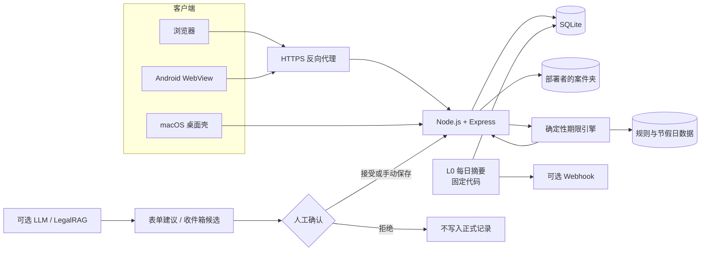

<p align="center">
  
</p>

<h1 align="center">案齐 ANQI</h1>

<p align="center">为独立执业律师设计的自托管案件工作台</p>

<p align="center">
  
  <a href="LICENSE"></a>
  
  
  
</p>

<p align="center">
  
</p>

> [!WARNING]
> 案齐是案件管理工具，不是法律意见、法律检索服务或执业替代品。内置期限规则不保证完整、持续有效或适用于具体案件；启用规则前，必须由具备相应资格的人结合现行法、司法解释、法院通知和个案情况独立核验。任何期限、程序和金额都应由使用者最终确认。详见 [LEGAL-NOTICE.md](LEGAL-NOTICE.md)。

## 30 秒理解案齐

案齐把案件台账、法定期限、程序阶段、待办、工作日志、日历、联系人、案件文件和律师费放进一个本地优先的工作台。它面向 solo 律师及小规模自托管场景：一套 Node.js 服务、一个 SQLite 文件、一个由部署者掌控的案件夹，不依赖云端协作套件，也没有前端构建步骤。

它**不是**律所 ERP、多人权限平台、客户门户、云服务或法律意见生成器。案齐不让模型计算期限，也不允许模型绕过人工确认写入正式记录；不开启任何 LLM 配置时，案件管理、期限引擎和基础提醒仍可独立运行。

| 能力 | 解决什么问题 |
|---|---|
| 案件台账与程序阶段 | 集中记录案号、当事人、法院、程序与阶段；用阶段模板铺设后续动作 |
| 确定性期限引擎 | 从人工确认的程序事件和规则数据推算期限，处理节假日顺延，保护人工覆盖 |
| 待办、工作日志与日历 | 区分法定死线、任务截止日和计划开工日，在案件时间线与月历中统一查看 |
| 律师费与合作分成 | 跟踪已收、待收、逾期、金额待定、分成协议、结算快照与追加式更正 |
| 联系人与统计 | 管理案件关联联系人，从期限、在办案件、费用和工作节奏观察个人执业状态 |
| 案件文件桥 | 以部署者配置的案件夹为文件真相源，在网页中安全浏览、上传和引用文件 |
| 收件箱与快录 | 异步提取先进入待裁决队列；同步整理只回填待办/日志表单，均由人确认 |
| L0 每日摘要 | 固定代码直接发送基础提醒，不经过模型，模型服务故障不影响期限提示 |
| 可选 LegalRAG | 对显式选定的案件文件做检索增强与候选提取；不开启时核心功能不受影响 |
| 多端与三种皮肤 | Web、macOS 桌面壳和 Android WebView 共用服务；`pro`、`paper`、`jade` 共用布局骨架 |

## 一个骨架，三种材质

<table>
  <thead>
    <tr>
      <th width="33%">专业 · pro</th>
      <th width="33%">纸感 · paper</th>
      <th width="33%">翡翠 · jade</th>
    </tr>
  </thead>
  <tbody>
    <tr>
      <td></td>
      <td></td>
      <td></td>
    </tr>
  </tbody>
</table>

三种皮肤只改变材质、颜色和质感，不改变信息结构与布局尺寸。九张当前界面截图（案件、日历、费用 × 三种皮肤）均位于 [`docs/images/`](docs/images/)。

## 不可绕过的边界

案齐把以下约束实现为架构不变量，而不是提示词约定：

1. **LLM 永不计算期限。** 期限只能由确定性 deadline engine 推算。
2. **LLM 永不直接写入正式记录。** 异步产物进入收件箱；同步辅助只回填表单，均须人工确认。
3. **人工覆盖不会被静默重算。** 法官或承办人员实际指定的日期可以标记为人工覆盖，级联重算默认排除。
4. **L0 提醒不依赖模型。** 每日摘要由固定代码发送；任何模型层故障都不应影响基础提醒。
5. **文件和数据由部署者掌控。** SQLite 数据库与案件夹留在自选主机；只有启用可选模型功能时，明确输入或选择的内容才会发送给配置的供应商。

更完整的设计约束见 [docs/DESIGN.md](docs/DESIGN.md)。UI 贡献前请同时阅读 [docs/DESIGN-TOKENS.md](docs/DESIGN-TOKENS.md)。

## 架构



核心是单进程、单数据库的自托管应用。浏览器和 Android 通过 HTTPS 访问；macOS 桌面版在本机随机回环端口运行同一服务。可选模型只能抵达表单建议或收件箱候选，人工确认是进入正式记录的唯一门。

## 快速开始：Docker 固定版本

推荐使用固定版本镜像 `ghcr.io/zj-ai-lab/anqi:2.6.0`。下面的完整示例只把服务暴露到宿主机回环地址，并持久化数据库和案件夹；配置 HTTPS 入口前，不要把 3000 端口绑定到公网地址。

要求：Docker、`openssl`，以及一个仅部署账号可读的工作目录。

```sh
IMAGE=ghcr.io/zj-ai-lab/anqi:2.6.0
mkdir -p anqi/data anqi/case-files
cd anqi
docker pull "$IMAGE"

read -s -p "管理员密码: " P
printf '\n'
PASS_HASH=$(docker run --rm \
  -e ANJIAN_PASSWORD="$P" \
  --entrypoint node "$IMAGE" /app/tools/hash-password.js)
unset P
INTERNAL_KEY=$(openssl rand -hex 32)

umask 077
cat > .env <<EOF
NODE_ENV=production
HOST=0.0.0.0
PORT=3000
DB_PATH=/app/data/anjian.db
ANJIAN_USER=admin
ANJIAN_PASS_HASH=$PASS_HASH
ANJIAN_INTERNAL_KEY=$INTERNAL_KEY
ANJIAN_TRUST_PROXY=loopback
ANJIAN_FILES_ROOT=/app/files
EOF
unset PASS_HASH INTERNAL_KEY

# .env 必须保持为仅部署账号可读
test "$(stat -f '%Lp' .env 2>/dev/null || stat -c '%a' .env)" = 600

docker run -d \
  --name anqi \
  --restart unless-stopped \
  --env-file "$PWD/.env" \
  -p 127.0.0.1:3000:3000 \
  -v "$PWD/data:/app/data" \
  -v "$PWD/case-files:/app/files" \
  "$IMAGE"

curl -fsS http://127.0.0.1:3000/healthz
```

登录地址暂为 `http://127.0.0.1:3000`。确认 health check、migration 和登录正常后，再按 [SELF-HOSTING.md](SELF-HOSTING.md) 配置 HTTPS 反向代理、可信代理范围、备份和恢复演练。反向代理必须阻止公网访问 `/internal/*`；确需内部自动化时，只在受控网络使用独立的 `X-Anjian-Key`。

> [!IMPORTANT]
> 每次升级前先备份 SQLite、案件夹和配置。固定镜像标签优先于 `latest`；数据库 migration 通常向前，回退旧镜像时应同时恢复升级前备份。

## 从源码运行

推荐使用 Node.js 22 LTS 或更高版本。Node.js 20 仍可运行，但安装 `better-sqlite3` 时需要本机编译工具链。先安装依赖、生成凭据并写好 `.env`，通过检查后再启动服务：

```sh
git clone https://github.com/zj-ai-lab/anqi.git
cd anqi
npm ci

read -s -p "管理员密码: " P
printf '\n'
PASS_HASH=$(ANJIAN_PASSWORD="$P" node tools/hash-password.js)
unset P
INTERNAL_KEY=$(openssl rand -hex 32)
mkdir -p data/files

umask 077
cat > .env <<EOF
NODE_ENV=development
HOST=127.0.0.1
PORT=3000
ANJIAN_USER=admin
ANJIAN_PASS_HASH=$PASS_HASH
ANJIAN_INTERNAL_KEY=$INTERNAL_KEY
ANJIAN_TRUST_PROXY=false
ANJIAN_FILES_ROOT=$PWD/data/files
EOF
unset PASS_HASH INTERNAL_KEY

npm run check
npm run dev
```

正常运行必须配置管理员账号和版本化 scrypt hash。不要依赖隐式“开发模式”，也不要把 `.env`、数据库、案件文件、日志或真实当事人信息提交到 Git。仅供空测试库使用的 `ANJIAN_UNSAFE_NO_AUTH=1` 受非 production、明确回环 IP 等硬限制，不能用于日常部署。

## Android 连接自托管实例

Android 壳**不内置任何服务器地址**。首次启动时必须填写你控制的实例根地址，之后可通过原生“服务器”按钮切换：

- 地址只接受 `http` 或 `https`，不能含用户名、密码、query、fragment 或非根路径；
- 公网主机名和公网 IP 必须使用 HTTPS；
- HTTP 只允许 loopback、RFC1918 私网地址和 `.local`，并显示“明文传输，仅限可信局域网”；
- HTTP 不会因“在局域网”而获得加密，使用者须自行确保网络可信；
- 外部深链与 WebView 导航按 scheme、host、有效端口做严格同源比较；
- 切换到另一服务器会清除 Cookie、Web Storage、缓存和页面历史，随后需要重新登录。

Android 只是现有自托管实例的客户端，不会创建云端账号或托管数据。完整规则和反向代理要求见 [SELF-HOSTING.md](SELF-HOSTING.md#android-连接自托管实例)。

## 获取发行版

- **Docker**：`ghcr.io/zj-ai-lab/anqi:2.6.0`；优先使用固定版本标签。
- **macOS**：从 [GitHub Releases](https://github.com/zj-ai-lab/anqi/releases) 下载对应架构的 DMG，并核对 Release 说明和校验信息。
- **Android**：从 [GitHub Releases](https://github.com/zj-ai-lab/anqi/releases) 获取 APK；首次启动需填写自托管实例地址。
- **源码**：克隆本仓库，按 [SELF-HOSTING.md](SELF-HOSTING.md) 部署。

macOS 未签名或未公证的发行物可能被 Gatekeeper 阻止。不要为来源不明的 DMG 关闭系统安全功能，也不要安装无法核对来源和校验信息的 APK。

## 技术栈

- Node.js ESM + Express
- SQLite + better-sqlite3
- Vanilla JavaScript + HTML + CSS
- Electron macOS 桌面壳
- Kotlin 单 Activity Android WebView 壳
- Docker 单容器部署
- 编号 SQL migration 与 JSON 期限规则

项目默认不引入新的运行时依赖，并以低功耗设备可运行、备份可理解、故障可恢复作为约束。

## 名称与兼容性

产品名是**案齐 / ANQI**。历史内部标识 `anjian` 会永久保留，包括：

- npm package identifier `anjian`；
- Electron appId `asia.fdonglawyer.anjian`；
- Android `namespace` 与 `applicationId` `com.fdong.anjian`；
- `ANJIAN_*` 环境变量和 `X-Anjian-Key`；
- localStorage 键、数据库文件名、Electron userData identity 与既有审计 actor 值。

这些标识关系到已有安装和持久化数据，看到 `anjian` 并不表示遗漏改名。第三方集成不应擅自改写它们。

## 参与与治理

欢迎：

- 在 Issues 报告可复现缺陷或提出需求；
- 在 Discussions 的 Q&A 与 Ideas 分类交流使用经验；
- Fork 后按 AGPL 条款维护自己的版本。

本项目目前由单一维护者保持架构一致性，**不接收外部 Pull Request**。请不要在 Issue 或 Discussion 中粘贴大段实现代码、完整补丁、真实案件材料、当事人信息、访问地址、日志或凭据。完整规则见 [CONTRIBUTING.md](CONTRIBUTING.md)。

安全问题请勿公开提交，按 [SECURITY.md](SECURITY.md) 使用 GitHub 私密漏洞报告。

## 许可证

案齐源代码以 [GNU Affero General Public License v3.0 only](LICENSE)（`AGPL-3.0-only`）授权。该许可证允许商业使用、修改和再分发，同时要求满足其源码提供及网络交互相关义务。

第三方软件、字体和素材仍按各自许可证授权，详见 [ACKNOWLEDGEMENTS.md](ACKNOWLEDGEMENTS.md)。项目名称、图标及其他可能构成商标或品牌标识的素材不因 AGPL 自动授予商标权；详见 [LEGAL-NOTICE.md](LEGAL-NOTICE.md)。

## 作者

由 [方律师](https://me.fdonglawyer.asia/) 发起和维护。
